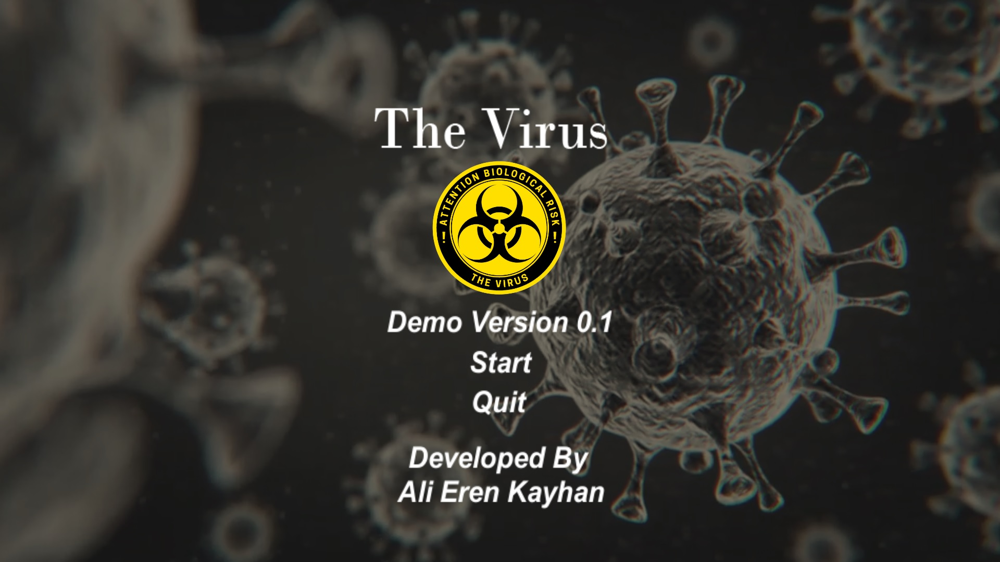
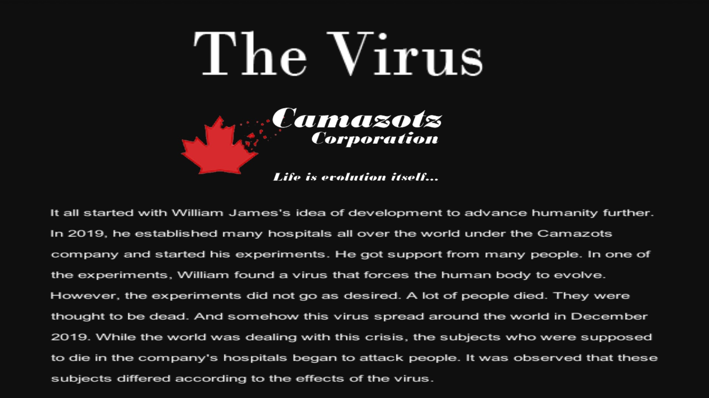
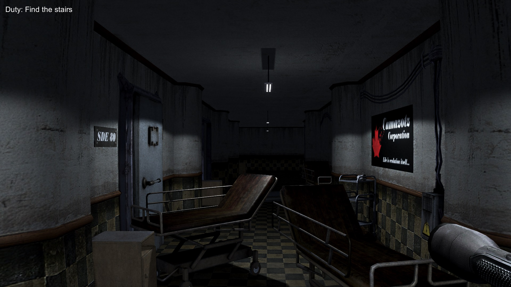
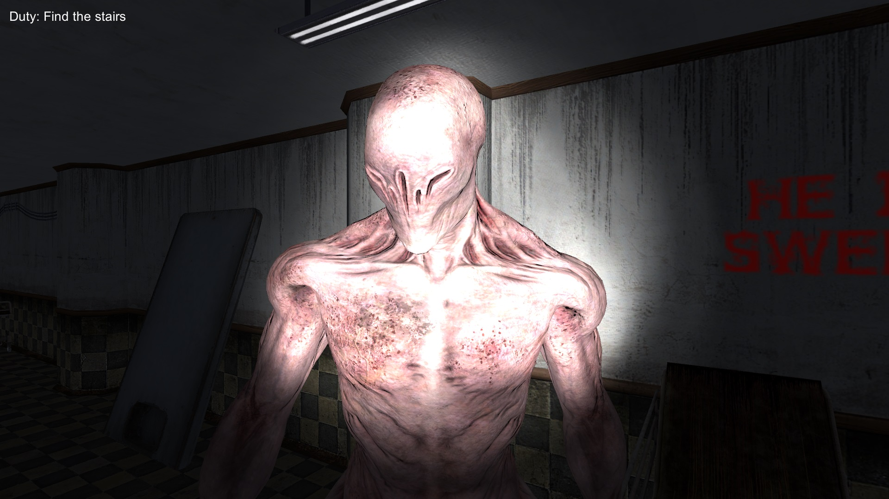

    
# TheVirus

    
  
   

 
    
 

 

 

 

 
    

- Develop a 3D horror game in Unity
- Solo game developer
- Published on itch.io
- You can play it from this website = https://alierenkayhan.itch.io/the-virus
 
## Table of Contents

* [General Info](#TheVirus)
* [Technologies Used](#Technologies)
* [Prerequisites](#Prerequisites)
* [Features](#Features)
* [Screenshots](#Screenshots)
* [Game](#Game)
* [Setup](#Setup)
* [Lisans](#Lisans)
* [Feedback](#Feedback)
* [Reference](#Reference)
 
## Technologies
-  
- 
- 

## Features
1-Features of TheVirus  
    - 3D game 
    - Horror game  
   
## Screenshots
  1-Screenshots of TheVirus
  <table> 
    <tr>
        <td>  
</td>
        <td>  
</td>
    </tr>
    <tr>
        <td>  
</td>
        <td>  
</td>
    </tr>
   </table>

## Game

## Setup  
  -Go to the link. 
  -Download the game. 
  -Export it from zip. 
  -Find the file which has with ".exe" extension and open it. 
 
## Lisans

This project is licensed under the terms of the [MIT](https://choosealicense.com/licenses/mit/) license.

  
## Feedback

If you have any feedback, please contact me at ali_erenbatman@hotmail.com.
  
## Reference
    -https://github.com/alexandresanlim/Badges4-README.md-Profile
    -https://shields.io/
